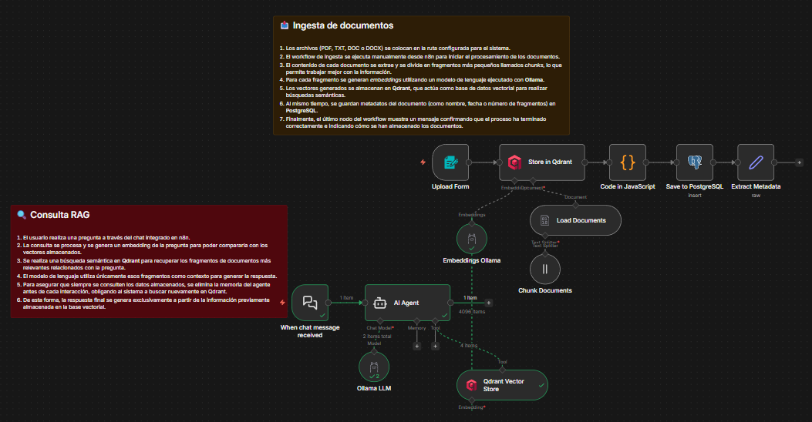
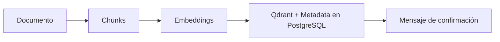
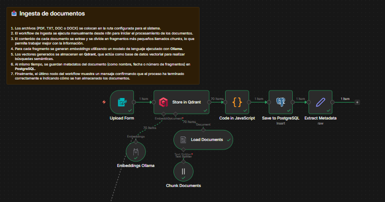
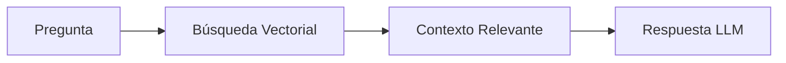
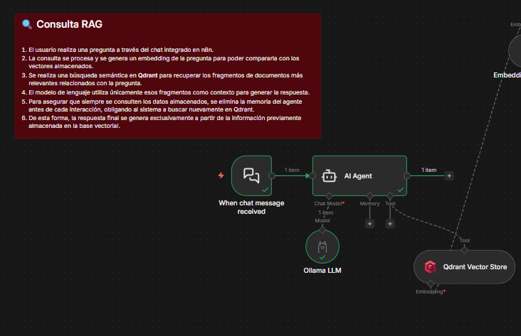
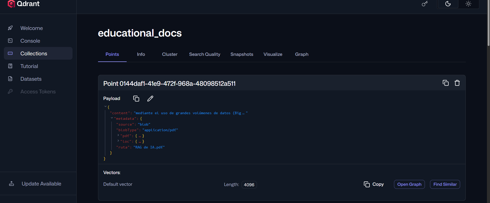
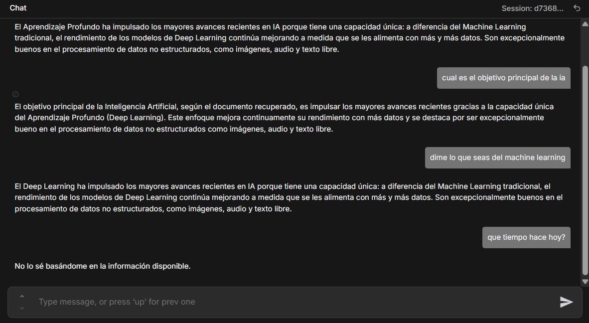

# Proyecto A: Sistema RAG Educativo

> Proyecto desarrollado por **Pablo Hernández** y **Gregorio López**  
> IES Hermenegildo Lanz - 2º DAW - Desarrollo de Agentes IA para Web  
> Profesor: Isaías Fernández Lozano

---

## 📋 Descripción del Proyecto

Sistema inteligente de **Retrieval-Augmented Generation (RAG)** diseñado para vectorizar y analizar documentos educativos (`PDF`, `TXT`, `DOC`, `DOCX`), permitiendo responder preguntas basadas únicamente en el conocimiento extraído de esos archivos. El sistema asegura respuestas contextuales y precisas mediante búsqueda vectorial avanzada.

---

## 🏗️ Stack Tecnológico

| Herramienta     | Descripción                                                                 |
|-----------------|-----------------------------------------------------------------------------|
| **n8n**         | Orquestación y automatización de workflows RAG                              |
| **Ollama**      | Modelos de lenguaje de Jarvis para embeddings y generación de respuestas    |
| **Qdrant**      | Base de datos vectorial para búsqueda semántica de documentos               |
| **PostgreSQL**  | Almacenamiento de metadatos                                                 |

---

## 🔄 Estructura del Workflow RAG



### 1. **Ingesta de Documentos**



- **Lectura de documentos** (`PDF/TXT/DOC/DOCX`)
- **División en fragmentos procesables**
- **Generación de embeddings vectoriales**
- **Almacenamiento simultáneo** en Qdrant y PostgreSQL

---



### 2. **Procesamiento de Consultas**



- **Vectorización** de la pregunta del usuario
- **Búsqueda semántica** en Qdrant
- **Recuperación de contexto relevante**
- **Generación de respuesta** mediante LLM

---



## 📊 Esquema SQL

```sql
CREATE TABLE rag_documents (
 id SERIAL PRIMARY KEY,
 nombre VARCHAR(255),
 num_chunks INTEGER,
 fecha_procesado TIMESTAMP DEFAULT NOW()
);
```


---

## 🔗 Explicación del workflow

A diferencia de las recomendaciones de Moodle, el proceso de ingesta y búsqueda se realiza dentro de un mismo workflow.  
Al no disponer de un ordenador que soporte bien los modelos de Ollama, se utilizan los modelos de Jarvis para asegurar el correcto funcionamiento.

- **Modelo para consultas:** `qwen2.5:7b-instruct`
- **Modelo para embeddings:** `mistral:instruct`

> El modelo `mistral:instruct` es el que mejor funciona para generar embeddings y ya lo hemos usado anteriormente.  
> El modelo `qwen2.5:7b-instruct` es sencillo de limitar y soporta herramientas como *Qdrant Vector Store*, necesarias para el proceso de búsqueda.

---

### Explicación por nodos

#### Ingesta de documentos


- **Upload Form:** acepta archivos `.pdf, .txt, .doc, .docx`.  
    Al ejecutar el flujo, se abre una pestaña con la url  
    `http://localhost:5678/webhook-test/upload-document/n8n-form` para subir los archivos.

- **Store in Qdrant:**  
    - Usa la credencial del contenedor de Qdrant  
    - *Operation mode*: `Insert Documents`  
    - *Collection*: `educational_docs`  
    - *Embedding batch size*: 100  
    - Guarda los vectores en la colección

        - <u>Embeddings Ollama</u>: convierte cada fragmento de texto en un vector numérico.
        - <u>Load Documents</u>: carga el documento y lo transforma en texto.
        - <u>Chunk Documents</u>: divide el documento en *chunks* de 500 palabras.

- **Code in JavaScript:** extrae los datos necesarios para pasar al nodo de postgres.

```javascript
return [
 {
    json: {
     nombre: $items()[0].json.metadata.source,
     num_chunks: $items().length
    }
 }
];
```

- **Save to PostgreSQL:**  
    Guarda los datos extraídos del nodo anterior en la tabla `rag_documents`.

- **Extract Metadata:**  
    Muestra en los logs un mensaje de confirmación y devuelve la siguiente información:

```json
{
 "status": "success",
 "mensaje": "Documento vectorizado correctamente",
 "documento": "{{$json.nombre}}",
 "chunks": "{{$json.num_chunks}}",
 "vector_store": "Qdrant",
 "embeddings": "Ollama"
}
```

---

### Qdrant Dashboard



---

#### Consulta RAG


- **When chat message received:** se activa cuando se escribe un mensaje por el chat de n8n.
- **AI Agent:** recibe el mensaje del usuario y aplica el prompt configurado.
        - <u>Ollama LLM</u>: proporciona el modelo para el agente.
        - <u>Qdrant Vector Store</u>: busca los chunks más similares a la pregunta.

**Ejemplo:**

> Pregunta:  
> ¿Qué es la ia?  
>
> Encuentra:  
> Chunk 1: explicación de inteligencia artificial  
> Chunk 2: aplicación en tecnología  
> Chunk 3: machine learning  
>
> Recupera el contexto relevante.

Está conectado al mismo modelo de embeddings que el flujo de ingesta para que los vectores coincidan.

> El agente **no tiene memoria de chat** para obligarlo a buscar cada pregunta en la colección y evitar respuestas erróneas de la memoria, limitando así que el modelo divague con la información devuelta.

---

### Muestras de interacción con el agente



> El prompt especifica que debe responder en caso de no encontrar coincidencia con la pregunta y que no debe *inventar* si no encuentra respuesta o si la información es insuficiente.

---

### 🚧 Dificultades encontradas

    - Dificultad para configurar correctamente las credenciales de Qdrant y PostgreSQL en el entorno local.
    - Errores en la extracción de metadatos de documentos con formatos poco comunes o mal estructurados.
    - Limitaciones en el tamaño de los archivos procesados, lo que obligó a dividir manualmente algunos documentos grandes.
    - Latencia elevada en la generación de embeddings cuando se procesaban muchos chunks simultáneamente.
    - Incertidumbre en la interpretación de algunos resultados del dashboard de Qdrant, especialmente al visualizar los vectores almacenados.

---