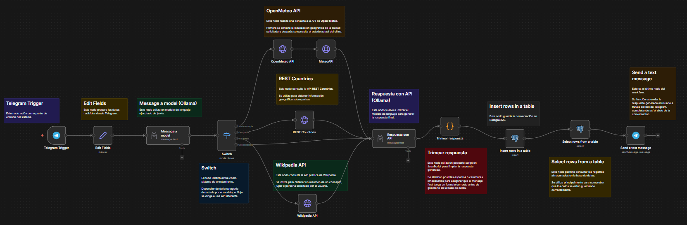
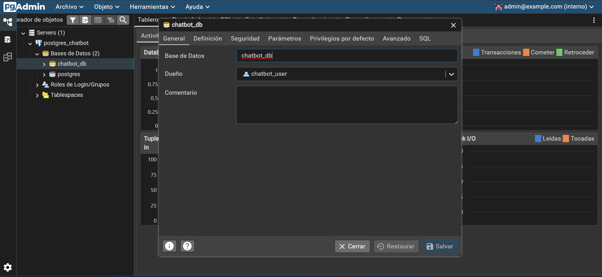
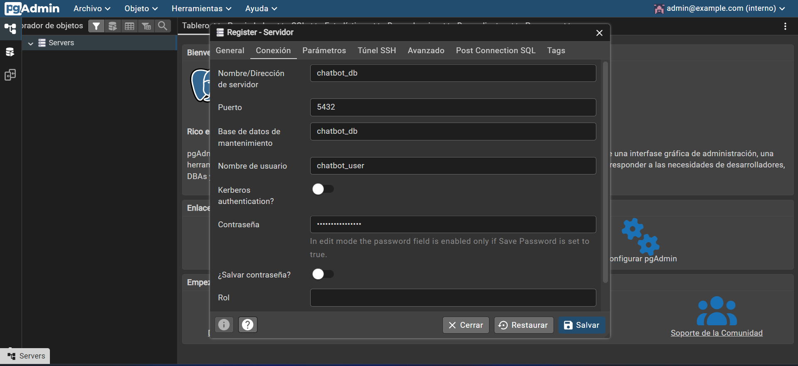

# 🤖 HITO 3: Chatbot Multiherramienta con n8n y Ollama


Proyecto elaborado para el módulo **Desarrollo de Agentes IA para Web** (2º DAW)  
📍 **IES Hermenegildo Lanz**

---

## 📖 Descripción del Proyecto

Este proyecto implementa un **Chatbot Multiherramienta Inteligente** utilizando **n8n** como motor de orquestación visual. El sistema es capaz de analizar la intención del usuario y determinar la herramienta o API externa adecuada para proporcionar la mejor respuesta posible. Además, integra modelos de lenguaje mediante **Ollama** y mantiene un registro persistente de las conversaciones utilizando **PostgreSQL**.

### 🛠️ Capacidades y Herramientas Integradas

El flujo completo del chatbot gestiona los mensajes de los usuarios y delega la tarea a la API correspondiente:

- 📱 **Telegram Bot**: Actúa como punto de entrada (Trigger) y salida para comunicarse directamente con el usuario.
- ☀️ **Open-Meteo API**: Consulta del estado actual del clima tras analizar una ciudad.
- 🌍 **REST Countries**: Búsqueda de información y datos geográficos sobre países.
- 📚 **Wikipedia API**: Búsqueda de resúmenes sobre lugares, personas o conceptos analizados.
- 🧠 **Ollama**: Utilizado por partida doble; primero para clasificar/enrutar la intención de búsqueda, y después para generar una respuesta natural a través de su API estructurada.
- 💾 **PostgreSQL**: Elementos para la inserción y selección de filas, manteniendo un historial en la base de datos (`chatID`, `username`, `mensajeUser`, `mensajeIA`, `fecha`).

---

## 🚀 Tecnologías Utilizadas

- **n8n**: Plataforma de orquestación visual y lógica de enrutamiento basado en IA.
- **Ollama**: Servidor local de Modelos de Lenguaje Grande (LLMs).
- **PostgreSQL**: Base de datos relacional robusta.
- **pgAdmin**: Interfaz web para la administración y monitorización de PostgreSQL.
- **Docker & Docker Compose**: Contenerización para despliegue rápido de la persistencia de datos y administración.
- **APIs REST Integradas**: Fuentes de datos en tiempo real.

---

## 📂 Arquitectura y Estructura del Proyecto

```text
hito3-automatizacion/
├── docker/
│   ├── docker-compose.yml   # Contenedores para base de datos (Postgres) y pgAdmin
│   └── .env.example         # Ejemplo de variables de entorno para Docker
├── docs/
│   └── capturas/            # Evidencias visuales de los flujos y estructura de DB
├── n8n/
│   └── workflows/           # Directorio para los workflows exportados (.json)
├── postgres/
│   └── init.sql             # Script SQL inicial (Crea tabla 'conversaciones_chatbot')
├── tests/
│   └── pruebas.http         # Batería de pruebas HTTP (REST Client) para las APIs
├── .gitignore
└── README.md
```

---

## 📸 Galería y Evidencias Visuales

A continuación se muestran algunas capturas detallando la configuración y el flujo de trabajo implementado:

### 1. Flujo de Trabajo en n8n

_(Orquestación general, enrutamiento semántico y lógica condicional de herramientas)_


### 2. Base de Datos del Chatbot

_(Estructura de la base de datos PostgreSQL y tabla de historiales de conversación)_


### 3. Conexión a la Base de Datos

_(Configuración del nodo de credenciales de PostgreSQL en n8n)_


---

## 🔧 Guía de Instalación y Despliegue

### Requisitos Previos

- Docker y Docker Compose instalados
- Token de Telegram Bot obtenido de [@BotFather](https://t.me/botfather)
- Acceso a la instancia de Ollama en `jarvis.ieshlanz.es`

### Pasos de Instalación

1. **Clonar el repositorio:**
    ```bash
    git clone https://github.com/gregoriolopeez/agentes-n8n.git
    cd hito3-automatizacion
    ```

2. **Configurar variables de entorno:**
    ```bash
    cp docker/.env.example docker/.env
    # Editar docker/.env con tus credenciales
    ```

3. **Iniciar contenedores:**
    ```bash
    cd docker
    docker-compose up -d
    ```

4. **Importar workflow en n8n:**
    - Acceder a `http://localhost:5678`
    - Importar archivo de `n8n/workflows/`
    - Configurar credenciales de Telegram y PostgreSQL

5. **Verificar base de datos:**
    - Acceder a pgAdmin: `http://localhost:5050`
    - Ejecutar script `postgres/init.sql`

---

## 💡 Demostración y Ejemplos

### Ejemplo 1: Consulta del Clima

**Usuario:** `¿Qué tiempo hace en Madrid?`

**Proceso:**
- Ollama clasifica como consulta climatológica
- Open-Meteo obtiene coordenadas y predicción
- Respuesta: `En Madrid: 22°C, despejado con vientos moderados`

### Ejemplo 2: Información Geográfica

**Usuario:** `Cuéntame sobre Francia`

**Proceso:**
- Ollama identifica búsqueda informativa
- REST Countries retorna datos del país
- Wikipedia complementa con información cultural
- Respuesta estructurada con datos verificados

### Ejemplo 3: Búsqueda General

**Usuario:** `¿Quién fue Albert Einstein?`

**Proceso:**
- Ollama enruta a búsqueda enciclopédica
- Wikipedia API retorna resumen
- Ollama genera respuesta contextualizada
- Historial guardado en PostgreSQL

---

## 📋 Pruebas Unitarias de APIs (REST)

Dentro de la carpeta `tests/` se facilita el archivo `pruebas.http`. En él se encuentran testeadas todas las peticiones a las diferentes APIs utilizadas en el proyecto.

- **Open-Meteo:** Test para la obtención de coordenadas exactas y predicción por días.
- **REST Countries:** Búsqueda y obtención de JSON con información de un país.
- **Wikipedia API:** Petición GET al Action API de MediaWiki para resúmenes.
- **Ollama (Generación):** Test de conectividad a la instancia remota `jarvis.ieshlanz.es` con el modelo `mistral:instruct` usado en nuestro n8n.

---

## ⚙️ Estado Actual de Realización

- [x] Estructura inicial de carpetas creada
- [x] Base de datos inicial y tabla de conversaciones definida (`init.sql`)
- [x] Entorno Docker Compose configurado y validado
- [x] Identificación y testing de todas las APIs involucradas (`pruebas.http`)
- [x] Capturas informativas añadidas al README con Markdown
- [x] Workflow de n8n exportado al proyecto (`n8n/workflows/`)
- [ ] Guía de instalación y despliegue documentada
- [ ] Vídeo demostrativo grabado y enlazado

---

## 👨‍💻 Equipo de Desarrollo

Proyecto realizado conjuntamente por:

- **_Gregorio López_**
- **_Pablo Hernández_**

